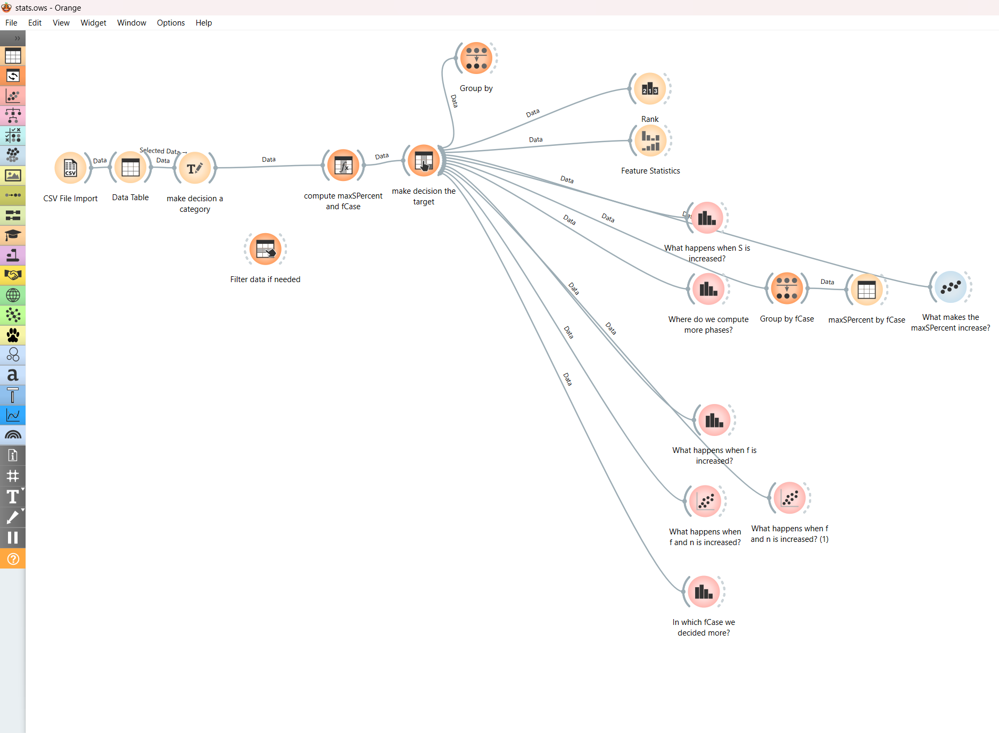
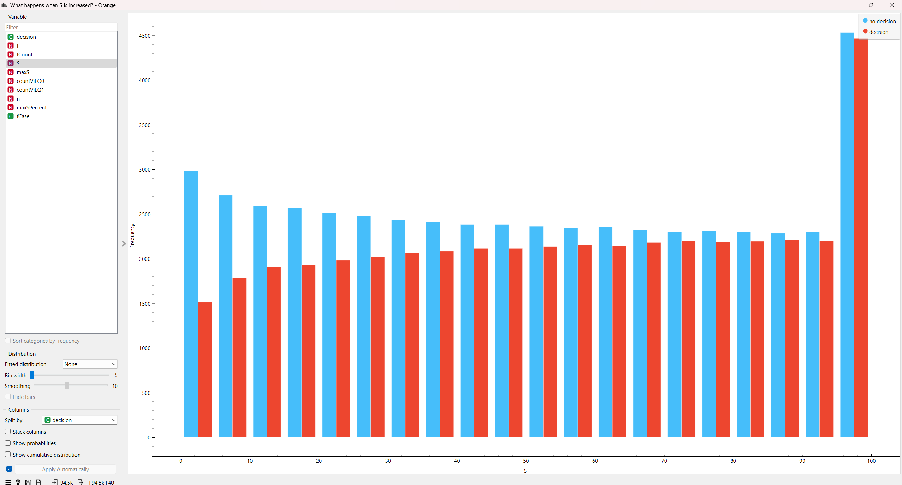
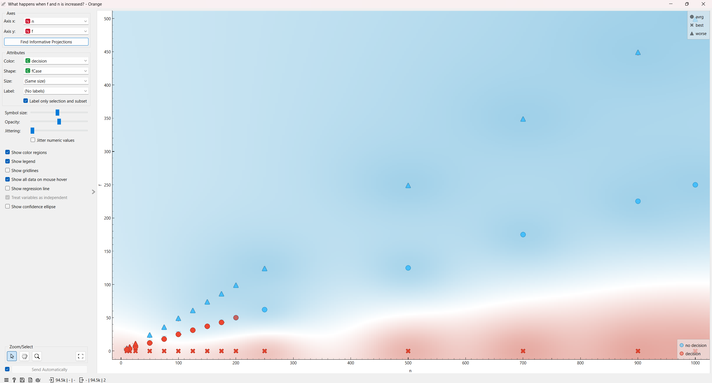
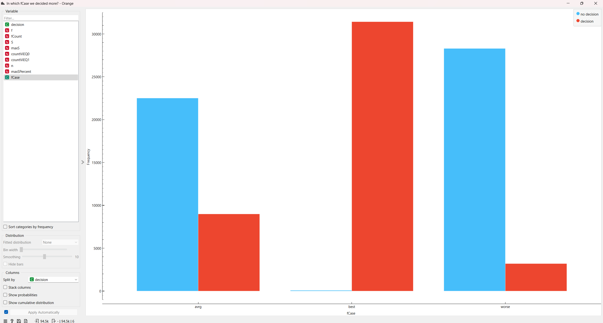

go-benor simulates the BenOr algorithm.

## Usage

After installing GO on your machine, you can just clone this repository and run `go run .` inside
the repository.

By default, the initial values will be generated randomly, but you can use the `-v` option to write
your desired initial values.

For more details on the available options, read below or type `go run . --help`.

```
Usage of /tmp/go-build3847868635/b001/exe/go-benor:
  -S int
        number of phases (default 10)
  -csv
        print the the stats in csv format. Headers: n,f,fCount,S,maxS,decision,countViEQ0,countViEQ1
  -f int
        max number of stops (default 4)
  -n int
        number of processes (default 10)
  -no-progress
        disable the progress bar
  -odds float
        the odds of a process to stop. Valid values from 0.0 to 1.0 (default 0.05)
  -quite
        no output
  -threads int
        number of threads to use. Defaults to number of vCPU
  -v string
        initial values of the processes. Example: 1 0 1 1
  -verbose
        print all the messages sent and received in real time
```

## Stops

go-benor will randomly stop the processes up to `f` processes. The stop can happen at any time
before starting a new phase. You can decide the odds of a process to stop by using the option
`--odds`.

## Termination probability

There is a [geogebra file](terminationProbability.ggb) to view the relation between `n` and `S`. It
can tell how big the `S` should be to get a good probability of termination.

## Output

By default, go-benor will show a progress bar of the computation. The total number of computations
is given by $n * S$.

After the computation is done, it will print in order:

1. initial values
2. decisions and at which phase it was taken:
    - 1
    - 0
    - -1 if a process did not decide
    - "stopped" if the process stopped
3. info:
    - the given input
    - number of processes needed for a majority: $\lfloor \frac{n}{2} \rfloor+ 1$
    - termination probability: $1 - (1 - \frac{1}{2^n})^S$
    - fCount: number of stopped processes
    - How many phases were needed to decide.

The option `--verbose` can be used to view every sent and received messages and when a process
starts a new phase. Do not use this when using big `n` or `S` because the console outputs will slow
down everything else. The progress bar will not be visible.

### Output example

command: `go run . -n 4 -f 1 --odds 0.8 --verbose`

<details>
<summary>Verbose Output</summary>

```
time="2024-12-11T21:40:52+01:00" level=debug msg="START PHASE" p=3 r=1 s=0
time="2024-12-11T21:40:52+01:00" level=debug msg="Message sent" data="(r:1, s:0, v:0)" from=3 to=1
time="2024-12-11T21:40:52+01:00" level=debug msg="START PHASE" p=2 r=1 s=0
time="2024-12-11T21:40:52+01:00" level=debug msg="START PHASE" p=1 r=1 s=0
time="2024-12-11T21:40:52+01:00" level=debug msg="Message sent" data="(r:1, s:0, v:0)" from=1 to=1
time="2024-12-11T21:40:52+01:00" level=debug msg="Message sent" data="(r:1, s:0, v:0)" from=1 to=2
time="2024-12-11T21:40:52+01:00" level=debug msg="Message sent" data="(r:1, s:0, v:0)" from=1 to=3
time="2024-12-11T21:40:52+01:00" level=debug msg=Gathering p=1 r=1 s=0
time="2024-12-11T21:40:52+01:00" level=debug msg="Message received" data="(r:1, s:0, v:0)" from=3 to=1
time="2024-12-11T21:40:52+01:00" level=debug msg="Message sent" data="(r:1, s:0, v:0)" from=3 to=2
time="2024-12-11T21:40:52+01:00" level=debug msg="Message sent" data="(r:1, s:0, v:0)" from=3 to=3
time="2024-12-11T21:40:52+01:00" level=debug msg=Gathering p=3 r=1 s=0
time="2024-12-11T21:40:52+01:00" level=debug msg="Message received" data="(r:1, s:0, v:1)" from=2 to=1
time="2024-12-11T21:40:52+01:00" level=debug msg="Message sent" data="(r:1, s:0, v:1)" from=2 to=1
time="2024-12-11T21:40:52+01:00" level=debug msg="Message sent" data="(r:1, s:0, v:1)" from=2 to=2
time="2024-12-11T21:40:52+01:00" level=debug msg="Message sent" data="(r:1, s:0, v:1)" from=2 to=3
time="2024-12-11T21:40:52+01:00" level=debug msg=Gathering p=2 r=1 s=0
time="2024-12-11T21:40:52+01:00" level=debug msg="Message received" data="(r:1, s:0, v:0)" from=3 to=2
time="2024-12-11T21:40:52+01:00" level=debug msg="Message received" data="(r:1, s:0, v:0)" from=1 to=2
time="2024-12-11T21:40:52+01:00" level=debug msg="Message received" data="(r:1, s:0, v:0)" from=1 to=3
time="2024-12-11T21:40:52+01:00" level=debug msg="Message received" data="(r:1, s:0, v:0)" from=3 to=3
time="2024-12-11T21:40:52+01:00" level=debug msg="Message received" data="(r:1, s:0, v:1)" from=2 to=3
time="2024-12-11T21:40:52+01:00" level=debug msg="START PHASE" p=3 r=2 s=0
time="2024-12-11T21:40:52+01:00" level=debug msg="Message received" data="(r:1, s:0, v:1)" from=2 to=2
time="2024-12-11T21:40:52+01:00" level=debug msg="START PHASE" p=2 r=2 s=0
time="2024-12-11T21:40:52+01:00" level=debug msg="Message sent" data="(r:2, s:0, v:-1)" from=2 to=1
time="2024-12-11T21:40:52+01:00" level=debug msg="Message sent" data="(r:2, s:0, v:-1)" from=2 to=2
time="2024-12-11T21:40:52+01:00" level=debug msg="Message sent" data="(r:2, s:0, v:-1)" from=2 to=3
time="2024-12-11T21:40:52+01:00" level=debug msg="Message received" data="(r:1, s:0, v:0)" from=1 to=1
time="2024-12-11T21:40:52+01:00" level=debug msg="START PHASE" p=1 r=2 s=0
time="2024-12-11T21:40:52+01:00" level=debug msg="Message sent" data="(r:2, s:0, v:-1)" from=1 to=1
time="2024-12-11T21:40:52+01:00" level=debug msg="Message sent" data="(r:2, s:0, v:-1)" from=1 to=2
time="2024-12-11T21:40:52+01:00" level=debug msg="Message sent" data="(r:2, s:0, v:-1)" from=1 to=3
time="2024-12-11T21:40:52+01:00" level=debug msg=Gathering p=1 r=2 s=0
time="2024-12-11T21:40:52+01:00" level=debug msg=Gathering p=2 r=2 s=0
time="2024-12-11T21:40:52+01:00" level=debug msg="Message received" data="(r:2, s:0, v:-1)" from=3 to=1
time="2024-12-11T21:40:52+01:00" level=debug msg="Message received" data="(r:2, s:0, v:-1)" from=2 to=1
time="2024-12-11T21:40:52+01:00" level=debug msg="Message sent" data="(r:2, s:0, v:-1)" from=3 to=1
time="2024-12-11T21:40:52+01:00" level=debug msg="Message sent" data="(r:2, s:0, v:-1)" from=3 to=2
time="2024-12-11T21:40:52+01:00" level=debug msg="Message sent" data="(r:2, s:0, v:-1)" from=3 to=3
time="2024-12-11T21:40:52+01:00" level=debug msg=Gathering p=3 r=2 s=0
time="2024-12-11T21:40:52+01:00" level=debug msg="Message received" data="(r:2, s:0, v:-1)" from=2 to=3
time="2024-12-11T21:40:52+01:00" level=debug msg="Message received" data="(r:2, s:0, v:-1)" from=1 to=3
time="2024-12-11T21:40:52+01:00" level=debug msg="Message received" data="(r:2, s:0, v:-1)" from=3 to=3
time="2024-12-11T21:40:52+01:00" level=debug msg="START PHASE" p=3 r=1 s=1
time="2024-12-11T21:40:52+01:00" level=debug msg="Message received" data="(r:2, s:0, v:-1)" from=2 to=2
time="2024-12-11T21:40:52+01:00" level=debug msg="Message received" data="(r:2, s:0, v:-1)" from=1 to=2
time="2024-12-11T21:40:52+01:00" level=debug msg="Message received" data="(r:2, s:0, v:-1)" from=3 to=2
time="2024-12-11T21:40:52+01:00" level=debug msg="Message received" data="(r:2, s:0, v:-1)" from=1 to=1
time="2024-12-11T21:40:52+01:00" level=debug msg="START PHASE" p=2 r=1 s=1
time="2024-12-11T21:40:52+01:00" level=debug msg="Message sent" data="(r:1, s:1, v:1)" from=2 to=1
time="2024-12-11T21:40:52+01:00" level=debug msg="Message sent" data="(r:1, s:1, v:1)" from=2 to=2
time="2024-12-11T21:40:52+01:00" level=debug msg="Message sent" data="(r:1, s:1, v:1)" from=2 to=3
time="2024-12-11T21:40:52+01:00" level=debug msg=Gathering p=2 r=1 s=1
time="2024-12-11T21:40:52+01:00" level=debug msg="Message sent" data="(r:1, s:1, v:0)" from=3 to=1
time="2024-12-11T21:40:52+01:00" level=debug msg="Message sent" data="(r:1, s:1, v:0)" from=3 to=2
time="2024-12-11T21:40:52+01:00" level=debug msg="Message sent" data="(r:1, s:1, v:0)" from=3 to=3
time="2024-12-11T21:40:52+01:00" level=debug msg=Gathering p=3 r=1 s=1
time="2024-12-11T21:40:52+01:00" level=debug msg="START PHASE" p=1 r=1 s=1
time="2024-12-11T21:40:52+01:00" level=debug msg="Message sent" data="(r:1, s:1, v:0)" from=1 to=1
time="2024-12-11T21:40:52+01:00" level=debug msg="Message sent" data="(r:1, s:1, v:0)" from=1 to=2
time="2024-12-11T21:40:52+01:00" level=debug msg="Message sent" data="(r:1, s:1, v:0)" from=1 to=3
time="2024-12-11T21:40:52+01:00" level=debug msg=Gathering p=1 r=1 s=1
time="2024-12-11T21:40:52+01:00" level=debug msg="Message received" data="(r:1, s:1, v:0)" from=3 to=1
time="2024-12-11T21:40:52+01:00" level=debug msg="Message received" data="(r:1, s:1, v:1)" from=2 to=1
time="2024-12-11T21:40:52+01:00" level=debug msg="Message received" data="(r:1, s:1, v:1)" from=2 to=2
time="2024-12-11T21:40:52+01:00" level=debug msg="Message received" data="(r:1, s:1, v:0)" from=3 to=2
time="2024-12-11T21:40:52+01:00" level=debug msg="Message received" data="(r:1, s:1, v:0)" from=1 to=2
time="2024-12-11T21:40:52+01:00" level=debug msg="START PHASE" p=2 r=2 s=1
time="2024-12-11T21:40:52+01:00" level=debug msg="Message sent" data="(r:2, s:1, v:-1)" from=2 to=1
time="2024-12-11T21:40:52+01:00" level=debug msg="Message received" data="(r:1, s:1, v:0)" from=1 to=1
time="2024-12-11T21:40:52+01:00" level=debug msg="START PHASE" p=1 r=2 s=1
time="2024-12-11T21:40:52+01:00" level=debug msg="Message sent" data="(r:2, s:1, v:-1)" from=2 to=2
time="2024-12-11T21:40:52+01:00" level=debug msg="Message sent" data="(r:2, s:1, v:-1)" from=2 to=3
time="2024-12-11T21:40:52+01:00" level=debug msg=Gathering p=2 r=2 s=1
time="2024-12-11T21:40:52+01:00" level=debug msg="Message sent" data="(r:2, s:1, v:-1)" from=1 to=1
time="2024-12-11T21:40:52+01:00" level=debug msg="Message received" data="(r:1, s:1, v:1)" from=2 to=3
time="2024-12-11T21:40:52+01:00" level=debug msg="Message received" data="(r:1, s:1, v:0)" from=3 to=3
time="2024-12-11T21:40:52+01:00" level=debug msg="Message sent" data="(r:2, s:1, v:-1)" from=1 to=2
time="2024-12-11T21:40:52+01:00" level=debug msg="Message sent" data="(r:2, s:1, v:-1)" from=1 to=3
time="2024-12-11T21:40:52+01:00" level=debug msg=Gathering p=1 r=2 s=1
time="2024-12-11T21:40:52+01:00" level=debug msg="Message received" data="(r:1, s:1, v:0)" from=1 to=3
time="2024-12-11T21:40:52+01:00" level=debug msg="START PHASE" p=3 r=2 s=1
time="2024-12-11T21:40:52+01:00" level=debug msg="Message sent" data="(r:2, s:1, v:-1)" from=3 to=1
time="2024-12-11T21:40:52+01:00" level=debug msg="Message sent" data="(r:2, s:1, v:-1)" from=3 to=2
time="2024-12-11T21:40:52+01:00" level=debug msg="Message sent" data="(r:2, s:1, v:-1)" from=3 to=3
time="2024-12-11T21:40:52+01:00" level=debug msg=Gathering p=3 r=2 s=1
time="2024-12-11T21:40:52+01:00" level=debug msg="Message received" data="(r:2, s:1, v:-1)" from=2 to=3
time="2024-12-11T21:40:52+01:00" level=debug msg="Message received" data="(r:2, s:1, v:-1)" from=1 to=3
time="2024-12-11T21:40:52+01:00" level=debug msg="Message received" data="(r:2, s:1, v:-1)" from=3 to=3
time="2024-12-11T21:40:52+01:00" level=debug msg="START PHASE" p=3 r=1 s=2
time="2024-12-11T21:40:52+01:00" level=debug msg="Message sent" data="(r:1, s:2, v:0)" from=3 to=1
time="2024-12-11T21:40:52+01:00" level=debug msg="Message sent" data="(r:1, s:2, v:0)" from=3 to=2
time="2024-12-11T21:40:52+01:00" level=debug msg="Message sent" data="(r:1, s:2, v:0)" from=3 to=3
time="2024-12-11T21:40:52+01:00" level=debug msg="Message received" data="(r:2, s:1, v:-1)" from=2 to=2
time="2024-12-11T21:40:52+01:00" level=debug msg="Message received" data="(r:2, s:1, v:-1)" from=1 to=2
time="2024-12-11T21:40:52+01:00" level=debug msg="Message received" data="(r:2, s:1, v:-1)" from=3 to=2
time="2024-12-11T21:40:52+01:00" level=debug msg="START PHASE" p=2 r=1 s=2
time="2024-12-11T21:40:52+01:00" level=debug msg="Message sent" data="(r:1, s:2, v:1)" from=2 to=1
time="2024-12-11T21:40:52+01:00" level=debug msg="Message sent" data="(r:1, s:2, v:1)" from=2 to=2
time="2024-12-11T21:40:52+01:00" level=debug msg="Message sent" data="(r:1, s:2, v:1)" from=2 to=3
time="2024-12-11T21:40:52+01:00" level=debug msg=Gathering p=2 r=1 s=2
time="2024-12-11T21:40:52+01:00" level=debug msg="Message received" data="(r:2, s:1, v:-1)" from=2 to=1
time="2024-12-11T21:40:52+01:00" level=debug msg="Message received" data="(r:2, s:1, v:-1)" from=1 to=1
time="2024-12-11T21:40:52+01:00" level=debug msg="Message received" data="(r:2, s:1, v:-1)" from=3 to=1
time="2024-12-11T21:40:52+01:00" level=debug msg="START PHASE" p=1 r=1 s=2
time="2024-12-11T21:40:52+01:00" level=debug msg="Message sent" data="(r:1, s:2, v:1)" from=1 to=1
time="2024-12-11T21:40:52+01:00" level=debug msg="Message sent" data="(r:1, s:2, v:1)" from=1 to=2
time="2024-12-11T21:40:52+01:00" level=debug msg="Message sent" data="(r:1, s:2, v:1)" from=1 to=3
time="2024-12-11T21:40:52+01:00" level=debug msg=Gathering p=1 r=1 s=2
time="2024-12-11T21:40:52+01:00" level=debug msg="Message received" data="(r:1, s:2, v:0)" from=3 to=2
time="2024-12-11T21:40:52+01:00" level=debug msg="Message received" data="(r:1, s:2, v:1)" from=2 to=2
time="2024-12-11T21:40:52+01:00" level=debug msg="Message received" data="(r:1, s:2, v:1)" from=1 to=2
time="2024-12-11T21:40:52+01:00" level=debug msg="START PHASE" p=2 r=2 s=2
time="2024-12-11T21:40:52+01:00" level=debug msg="Message sent" data="(r:2, s:2, v:-1)" from=2 to=1
time="2024-12-11T21:40:52+01:00" level=debug msg="Message sent" data="(r:2, s:2, v:-1)" from=2 to=2
time="2024-12-11T21:40:52+01:00" level=debug msg="Message sent" data="(r:2, s:2, v:-1)" from=2 to=3
time="2024-12-11T21:40:52+01:00" level=debug msg=Gathering p=2 r=2 s=2
time="2024-12-11T21:40:52+01:00" level=debug msg="Message received" data="(r:1, s:2, v:0)" from=3 to=1
time="2024-12-11T21:40:52+01:00" level=debug msg=Gathering p=3 r=1 s=2
time="2024-12-11T21:40:52+01:00" level=debug msg="Message received" data="(r:1, s:2, v:0)" from=3 to=3
time="2024-12-11T21:40:52+01:00" level=debug msg="Message received" data="(r:1, s:2, v:1)" from=2 to=3
time="2024-12-11T21:40:52+01:00" level=debug msg="Message received" data="(r:1, s:2, v:1)" from=1 to=3
time="2024-12-11T21:40:52+01:00" level=debug msg="START PHASE" p=3 r=2 s=2
time="2024-12-11T21:40:52+01:00" level=debug msg="Message sent" data="(r:2, s:2, v:-1)" from=3 to=1
time="2024-12-11T21:40:52+01:00" level=debug msg="Message sent" data="(r:2, s:2, v:-1)" from=3 to=2
time="2024-12-11T21:40:52+01:00" level=debug msg="Message received" data="(r:1, s:2, v:1)" from=2 to=1
time="2024-12-11T21:40:52+01:00" level=debug msg="Message received" data="(r:1, s:2, v:1)" from=1 to=1
time="2024-12-11T21:40:52+01:00" level=debug msg="START PHASE" p=1 r=2 s=2
time="2024-12-11T21:40:52+01:00" level=debug msg="Message sent" data="(r:2, s:2, v:-1)" from=1 to=1
time="2024-12-11T21:40:52+01:00" level=debug msg="Message sent" data="(r:2, s:2, v:-1)" from=1 to=2
time="2024-12-11T21:40:52+01:00" level=debug msg="Message sent" data="(r:2, s:2, v:-1)" from=1 to=3
time="2024-12-11T21:40:52+01:00" level=debug msg=Gathering p=1 r=2 s=2
time="2024-12-11T21:40:52+01:00" level=debug msg="Message received" data="(r:2, s:2, v:-1)" from=2 to=1
time="2024-12-11T21:40:52+01:00" level=debug msg="Message received" data="(r:2, s:2, v:-1)" from=3 to=1
time="2024-12-11T21:40:52+01:00" level=debug msg="Message received" data="(r:2, s:2, v:-1)" from=1 to=1
time="2024-12-11T21:40:52+01:00" level=debug msg="START PHASE" p=1 r=1 s=3
time="2024-12-11T21:40:52+01:00" level=debug msg="Message sent" data="(r:1, s:3, v:1)" from=1 to=1
time="2024-12-11T21:40:52+01:00" level=debug msg="Message sent" data="(r:1, s:3, v:1)" from=1 to=2
time="2024-12-11T21:40:52+01:00" level=debug msg="Message sent" data="(r:1, s:3, v:1)" from=1 to=3
time="2024-12-11T21:40:52+01:00" level=debug msg=Gathering p=1 r=1 s=3
time="2024-12-11T21:40:52+01:00" level=debug msg="Message sent" data="(r:2, s:2, v:-1)" from=3 to=3
time="2024-12-11T21:40:52+01:00" level=debug msg=Gathering p=3 r=2 s=2
time="2024-12-11T21:40:52+01:00" level=debug msg="Message received" data="(r:2, s:2, v:-1)" from=2 to=3
time="2024-12-11T21:40:52+01:00" level=debug msg="Message received" data="(r:2, s:2, v:-1)" from=3 to=3
time="2024-12-11T21:40:52+01:00" level=debug msg="Message received" data="(r:2, s:2, v:-1)" from=1 to=3
time="2024-12-11T21:40:52+01:00" level=debug msg="START PHASE" p=3 r=1 s=3
time="2024-12-11T21:40:52+01:00" level=debug msg="Message sent" data="(r:1, s:3, v:0)" from=3 to=1
time="2024-12-11T21:40:52+01:00" level=debug msg="Message sent" data="(r:1, s:3, v:0)" from=3 to=2
time="2024-12-11T21:40:52+01:00" level=debug msg="Message sent" data="(r:1, s:3, v:0)" from=3 to=3
time="2024-12-11T21:40:52+01:00" level=debug msg="Message received" data="(r:2, s:2, v:-1)" from=2 to=2
time="2024-12-11T21:40:52+01:00" level=debug msg="Message received" data="(r:2, s:2, v:-1)" from=3 to=2
time="2024-12-11T21:40:52+01:00" level=debug msg="Message received" data="(r:2, s:2, v:-1)" from=1 to=2
time="2024-12-11T21:40:52+01:00" level=debug msg="START PHASE" p=2 r=1 s=3
time="2024-12-11T21:40:52+01:00" level=debug msg="Message sent" data="(r:1, s:3, v:1)" from=2 to=1
time="2024-12-11T21:40:52+01:00" level=debug msg="Message sent" data="(r:1, s:3, v:1)" from=2 to=2
time="2024-12-11T21:40:52+01:00" level=debug msg="Message sent" data="(r:1, s:3, v:1)" from=2 to=3
time="2024-12-11T21:40:52+01:00" level=debug msg=Gathering p=2 r=1 s=3
time="2024-12-11T21:40:52+01:00" level=debug msg="Message received" data="(r:1, s:3, v:1)" from=1 to=2
time="2024-12-11T21:40:52+01:00" level=debug msg="Message received" data="(r:1, s:3, v:0)" from=3 to=2
time="2024-12-11T21:40:52+01:00" level=debug msg="Message received" data="(r:1, s:3, v:1)" from=2 to=2
time="2024-12-11T21:40:52+01:00" level=debug msg="START PHASE" p=2 r=2 s=3
time="2024-12-11T21:40:52+01:00" level=debug msg="Message sent" data="(r:2, s:3, v:-1)" from=2 to=1
time="2024-12-11T21:40:52+01:00" level=debug msg="Message sent" data="(r:2, s:3, v:-1)" from=2 to=2
time="2024-12-11T21:40:52+01:00" level=debug msg="Message sent" data="(r:2, s:3, v:-1)" from=2 to=3
time="2024-12-11T21:40:52+01:00" level=debug msg=Gathering p=2 r=2 s=3
time="2024-12-11T21:40:52+01:00" level=debug msg=Gathering p=3 r=1 s=3
time="2024-12-11T21:40:52+01:00" level=debug msg="Message received" data="(r:1, s:3, v:1)" from=1 to=3
time="2024-12-11T21:40:52+01:00" level=debug msg="Message received" data="(r:1, s:3, v:0)" from=3 to=3
time="2024-12-11T21:40:52+01:00" level=debug msg="Message received" data="(r:1, s:3, v:1)" from=1 to=1
time="2024-12-11T21:40:52+01:00" level=debug msg="Message received" data="(r:1, s:3, v:0)" from=3 to=1
time="2024-12-11T21:40:52+01:00" level=debug msg="Message received" data="(r:1, s:3, v:1)" from=2 to=1
time="2024-12-11T21:40:52+01:00" level=debug msg="START PHASE" p=1 r=2 s=3
time="2024-12-11T21:40:52+01:00" level=debug msg="Message sent" data="(r:2, s:3, v:-1)" from=1 to=1
time="2024-12-11T21:40:52+01:00" level=debug msg="Message sent" data="(r:2, s:3, v:-1)" from=1 to=2
time="2024-12-11T21:40:52+01:00" level=debug msg="Message sent" data="(r:2, s:3, v:-1)" from=1 to=3
time="2024-12-11T21:40:52+01:00" level=debug msg=Gathering p=1 r=2 s=3
time="2024-12-11T21:40:52+01:00" level=debug msg="Message received" data="(r:1, s:3, v:1)" from=2 to=3
time="2024-12-11T21:40:52+01:00" level=debug msg="START PHASE" p=3 r=2 s=3
time="2024-12-11T21:40:52+01:00" level=debug msg="Message sent" data="(r:2, s:3, v:-1)" from=3 to=1
time="2024-12-11T21:40:52+01:00" level=debug msg="Message sent" data="(r:2, s:3, v:-1)" from=3 to=2
time="2024-12-11T21:40:52+01:00" level=debug msg="Message sent" data="(r:2, s:3, v:-1)" from=3 to=3
time="2024-12-11T21:40:52+01:00" level=debug msg=Gathering p=3 r=2 s=3
time="2024-12-11T21:40:52+01:00" level=debug msg="Message received" data="(r:2, s:3, v:-1)" from=2 to=3
time="2024-12-11T21:40:52+01:00" level=debug msg="Message received" data="(r:2, s:3, v:-1)" from=1 to=3
time="2024-12-11T21:40:52+01:00" level=debug msg="Message received" data="(r:2, s:3, v:-1)" from=3 to=3
time="2024-12-11T21:40:52+01:00" level=debug msg="START PHASE" p=3 r=1 s=4
time="2024-12-11T21:40:52+01:00" level=debug msg="Message sent" data="(r:1, s:4, v:0)" from=3 to=1
time="2024-12-11T21:40:52+01:00" level=debug msg="Message received" data="(r:2, s:3, v:-1)" from=2 to=1
time="2024-12-11T21:40:52+01:00" level=debug msg="Message received" data="(r:2, s:3, v:-1)" from=1 to=1
time="2024-12-11T21:40:52+01:00" level=debug msg="Message received" data="(r:2, s:3, v:-1)" from=3 to=1
time="2024-12-11T21:40:52+01:00" level=debug msg="START PHASE" p=1 r=1 s=4
time="2024-12-11T21:40:52+01:00" level=debug msg="Message sent" data="(r:1, s:4, v:1)" from=1 to=1
time="2024-12-11T21:40:52+01:00" level=debug msg="Message sent" data="(r:1, s:4, v:1)" from=1 to=2
time="2024-12-11T21:40:52+01:00" level=debug msg="Message sent" data="(r:1, s:4, v:1)" from=1 to=3
time="2024-12-11T21:40:52+01:00" level=debug msg=Gathering p=1 r=1 s=4
time="2024-12-11T21:40:52+01:00" level=debug msg="Message received" data="(r:2, s:3, v:-1)" from=2 to=2
time="2024-12-11T21:40:52+01:00" level=debug msg="Message received" data="(r:2, s:3, v:-1)" from=1 to=2
time="2024-12-11T21:40:52+01:00" level=debug msg="Message received" data="(r:2, s:3, v:-1)" from=3 to=2
time="2024-12-11T21:40:52+01:00" level=debug msg="START PHASE" p=2 r=1 s=4
time="2024-12-11T21:40:52+01:00" level=debug msg="Message sent" data="(r:1, s:4, v:1)" from=2 to=1
time="2024-12-11T21:40:52+01:00" level=debug msg="Message sent" data="(r:1, s:4, v:1)" from=2 to=2
time="2024-12-11T21:40:52+01:00" level=debug msg="Message sent" data="(r:1, s:4, v:1)" from=2 to=3
time="2024-12-11T21:40:52+01:00" level=debug msg=Gathering p=2 r=1 s=4
time="2024-12-11T21:40:52+01:00" level=debug msg="Message received" data="(r:1, s:4, v:0)" from=3 to=2
time="2024-12-11T21:40:52+01:00" level=debug msg="Message received" data="(r:1, s:4, v:1)" from=1 to=2
time="2024-12-11T21:40:52+01:00" level=debug msg="Message received" data="(r:1, s:4, v:1)" from=2 to=2
time="2024-12-11T21:40:52+01:00" level=debug msg="START PHASE" p=2 r=2 s=4
time="2024-12-11T21:40:52+01:00" level=debug msg="Message sent" data="(r:2, s:4, v:-1)" from=2 to=1
time="2024-12-11T21:40:52+01:00" level=debug msg="Message sent" data="(r:2, s:4, v:-1)" from=2 to=2
time="2024-12-11T21:40:52+01:00" level=debug msg="Message sent" data="(r:2, s:4, v:-1)" from=2 to=3
time="2024-12-11T21:40:52+01:00" level=debug msg="Message sent" data="(r:1, s:4, v:0)" from=3 to=2
time="2024-12-11T21:40:52+01:00" level=debug msg="Message sent" data="(r:1, s:4, v:0)" from=3 to=3
time="2024-12-11T21:40:52+01:00" level=debug msg=Gathering p=3 r=1 s=4
time="2024-12-11T21:40:52+01:00" level=debug msg="Message received" data="(r:1, s:4, v:1)" from=1 to=3
time="2024-12-11T21:40:52+01:00" level=debug msg="Message received" data="(r:1, s:4, v:1)" from=2 to=3
time="2024-12-11T21:40:52+01:00" level=debug msg=Gathering p=2 r=2 s=4
time="2024-12-11T21:40:52+01:00" level=debug msg="Message received" data="(r:1, s:4, v:0)" from=3 to=3
time="2024-12-11T21:40:52+01:00" level=debug msg="Message received" data="(r:1, s:4, v:0)" from=3 to=1
time="2024-12-11T21:40:52+01:00" level=debug msg="Message received" data="(r:1, s:4, v:1)" from=1 to=1
time="2024-12-11T21:40:52+01:00" level=debug msg="Message received" data="(r:1, s:4, v:1)" from=2 to=1
time="2024-12-11T21:40:52+01:00" level=debug msg="START PHASE" p=1 r=2 s=4
time="2024-12-11T21:40:52+01:00" level=debug msg="Message sent" data="(r:2, s:4, v:-1)" from=1 to=1
time="2024-12-11T21:40:52+01:00" level=debug msg="Message sent" data="(r:2, s:4, v:-1)" from=1 to=2
time="2024-12-11T21:40:52+01:00" level=debug msg="Message sent" data="(r:2, s:4, v:-1)" from=1 to=3
time="2024-12-11T21:40:52+01:00" level=debug msg="START PHASE" p=3 r=2 s=4
time="2024-12-11T21:40:52+01:00" level=debug msg=Gathering p=1 r=2 s=4
time="2024-12-11T21:40:52+01:00" level=debug msg="Message sent" data="(r:2, s:4, v:-1)" from=3 to=1
time="2024-12-11T21:40:52+01:00" level=debug msg="Message sent" data="(r:2, s:4, v:-1)" from=3 to=2
time="2024-12-11T21:40:52+01:00" level=debug msg="Message sent" data="(r:2, s:4, v:-1)" from=3 to=3
time="2024-12-11T21:40:52+01:00" level=debug msg=Gathering p=3 r=2 s=4
time="2024-12-11T21:40:52+01:00" level=debug msg="Message received" data="(r:2, s:4, v:-1)" from=2 to=3
time="2024-12-11T21:40:52+01:00" level=debug msg="Message received" data="(r:2, s:4, v:-1)" from=1 to=3
time="2024-12-11T21:40:52+01:00" level=debug msg="Message received" data="(r:2, s:4, v:-1)" from=3 to=3
time="2024-12-11T21:40:52+01:00" level=debug msg="START PHASE" p=3 r=1 s=5
time="2024-12-11T21:40:52+01:00" level=debug msg="Message sent" data="(r:1, s:5, v:0)" from=3 to=1
time="2024-12-11T21:40:52+01:00" level=debug msg="Message sent" data="(r:1, s:5, v:0)" from=3 to=2
time="2024-12-11T21:40:52+01:00" level=debug msg="Message sent" data="(r:1, s:5, v:0)" from=3 to=3
time="2024-12-11T21:40:52+01:00" level=debug msg=Gathering p=3 r=1 s=5
time="2024-12-11T21:40:52+01:00" level=debug msg="Message received" data="(r:2, s:4, v:-1)" from=2 to=1
time="2024-12-11T21:40:52+01:00" level=debug msg="Message received" data="(r:2, s:4, v:-1)" from=1 to=1
time="2024-12-11T21:40:52+01:00" level=debug msg="Message received" data="(r:2, s:4, v:-1)" from=2 to=2
time="2024-12-11T21:40:52+01:00" level=debug msg="Message received" data="(r:2, s:4, v:-1)" from=1 to=2
time="2024-12-11T21:40:52+01:00" level=debug msg="Message received" data="(r:2, s:4, v:-1)" from=3 to=2
time="2024-12-11T21:40:52+01:00" level=debug msg="START PHASE" p=2 r=1 s=5
time="2024-12-11T21:40:52+01:00" level=debug msg="Message sent" data="(r:1, s:5, v:0)" from=2 to=1
time="2024-12-11T21:40:52+01:00" level=debug msg="Message sent" data="(r:1, s:5, v:0)" from=2 to=2
time="2024-12-11T21:40:52+01:00" level=debug msg="Message sent" data="(r:1, s:5, v:0)" from=2 to=3
time="2024-12-11T21:40:52+01:00" level=debug msg=Gathering p=2 r=1 s=5
time="2024-12-11T21:40:52+01:00" level=debug msg="Message received" data="(r:2, s:4, v:-1)" from=3 to=1
time="2024-12-11T21:40:52+01:00" level=debug msg="START PHASE" p=1 r=1 s=5
time="2024-12-11T21:40:52+01:00" level=debug msg="Message sent" data="(r:1, s:5, v:0)" from=1 to=1
time="2024-12-11T21:40:52+01:00" level=debug msg="Message sent" data="(r:1, s:5, v:0)" from=1 to=2
time="2024-12-11T21:40:52+01:00" level=debug msg="Message sent" data="(r:1, s:5, v:0)" from=1 to=3
time="2024-12-11T21:40:52+01:00" level=debug msg=Gathering p=1 r=1 s=5
time="2024-12-11T21:40:52+01:00" level=debug msg="Message received" data="(r:1, s:5, v:0)" from=3 to=1
time="2024-12-11T21:40:52+01:00" level=debug msg="Message received" data="(r:1, s:5, v:0)" from=2 to=1
time="2024-12-11T21:40:52+01:00" level=debug msg="Message received" data="(r:1, s:5, v:0)" from=3 to=3
time="2024-12-11T21:40:52+01:00" level=debug msg="Message received" data="(r:1, s:5, v:0)" from=2 to=3
time="2024-12-11T21:40:52+01:00" level=debug msg="Message received" data="(r:1, s:5, v:0)" from=1 to=3
time="2024-12-11T21:40:52+01:00" level=debug msg="START PHASE" p=3 r=2 s=5
time="2024-12-11T21:40:52+01:00" level=debug msg="Message sent" data="(r:2, s:5, v:0)" from=3 to=1
time="2024-12-11T21:40:52+01:00" level=debug msg="Message sent" data="(r:2, s:5, v:0)" from=3 to=2
time="2024-12-11T21:40:52+01:00" level=debug msg="Message sent" data="(r:2, s:5, v:0)" from=3 to=3
time="2024-12-11T21:40:52+01:00" level=debug msg=Gathering p=3 r=2 s=5
time="2024-12-11T21:40:52+01:00" level=debug msg="Message received" data="(r:1, s:5, v:0)" from=1 to=1
time="2024-12-11T21:40:52+01:00" level=debug msg="START PHASE" p=1 r=2 s=5
time="2024-12-11T21:40:52+01:00" level=debug msg="Message sent" data="(r:2, s:5, v:0)" from=1 to=1
time="2024-12-11T21:40:52+01:00" level=debug msg="Message sent" data="(r:2, s:5, v:0)" from=1 to=2
time="2024-12-11T21:40:52+01:00" level=debug msg="Message sent" data="(r:2, s:5, v:0)" from=1 to=3
time="2024-12-11T21:40:52+01:00" level=debug msg=Gathering p=1 r=2 s=5
time="2024-12-11T21:40:52+01:00" level=debug msg="Message received" data="(r:1, s:5, v:0)" from=3 to=2
time="2024-12-11T21:40:52+01:00" level=debug msg="Message received" data="(r:1, s:5, v:0)" from=2 to=2
time="2024-12-11T21:40:52+01:00" level=debug msg="Message received" data="(r:1, s:5, v:0)" from=1 to=2
time="2024-12-11T21:40:52+01:00" level=debug msg="START PHASE" p=2 r=2 s=5
time="2024-12-11T21:40:52+01:00" level=debug msg="Message sent" data="(r:2, s:5, v:0)" from=2 to=1
time="2024-12-11T21:40:52+01:00" level=debug msg="Message sent" data="(r:2, s:5, v:0)" from=2 to=2
time="2024-12-11T21:40:52+01:00" level=debug msg="Message sent" data="(r:2, s:5, v:0)" from=2 to=3
time="2024-12-11T21:40:52+01:00" level=debug msg=Gathering p=2 r=2 s=5
time="2024-12-11T21:40:52+01:00" level=debug msg="Message received" data="(r:2, s:5, v:0)" from=3 to=2
time="2024-12-11T21:40:52+01:00" level=debug msg="Message received" data="(r:2, s:5, v:0)" from=1 to=2
time="2024-12-11T21:40:52+01:00" level=debug msg="Message received" data="(r:2, s:5, v:0)" from=2 to=2
time="2024-12-11T21:40:52+01:00" level=debug msg=DECIDED decision=0 p=2 s=5
time="2024-12-11T21:40:52+01:00" level=debug msg="Message sent" data="(r:1, s:6, v:0)" from=2 to=1
time="2024-12-11T21:40:52+01:00" level=debug msg="Message sent" data="(r:1, s:6, v:0)" from=2 to=2
time="2024-12-11T21:40:52+01:00" level=debug msg="Message sent" data="(r:1, s:6, v:0)" from=2 to=3
time="2024-12-11T21:40:52+01:00" level=debug msg="Message received" data="(r:2, s:5, v:0)" from=3 to=3
time="2024-12-11T21:40:52+01:00" level=debug msg="Message received" data="(r:2, s:5, v:0)" from=1 to=3
time="2024-12-11T21:40:52+01:00" level=debug msg="Message received" data="(r:2, s:5, v:0)" from=2 to=3
time="2024-12-11T21:40:52+01:00" level=debug msg=DECIDED decision=0 p=3 s=5
time="2024-12-11T21:40:52+01:00" level=debug msg="Message sent" data="(r:1, s:6, v:0)" from=3 to=1
time="2024-12-11T21:40:52+01:00" level=debug msg="Message sent" data="(r:1, s:6, v:0)" from=3 to=2
time="2024-12-11T21:40:52+01:00" level=debug msg="Message sent" data="(r:1, s:6, v:0)" from=3 to=3
time="2024-12-11T21:40:52+01:00" level=debug msg="Message sent" data="(r:2, s:6, v:0)" from=3 to=1
time="2024-12-11T21:40:52+01:00" level=debug msg="Message sent" data="(r:2, s:6, v:0)" from=3 to=2
time="2024-12-11T21:40:52+01:00" level=debug msg="Message sent" data="(r:2, s:6, v:0)" from=3 to=3
time="2024-12-11T21:40:52+01:00" level=debug msg="Message sent" data="(r:2, s:6, v:0)" from=2 to=1
time="2024-12-11T21:40:52+01:00" level=debug msg="Message sent" data="(r:2, s:6, v:0)" from=2 to=2
time="2024-12-11T21:40:52+01:00" level=debug msg="Message sent" data="(r:2, s:6, v:0)" from=2 to=3
time="2024-12-11T21:40:52+01:00" level=debug msg="Message received" data="(r:2, s:5, v:0)" from=3 to=1
time="2024-12-11T21:40:52+01:00" level=debug msg="Message received" data="(r:2, s:5, v:0)" from=1 to=1
time="2024-12-11T21:40:52+01:00" level=debug msg="Message received" data="(r:2, s:5, v:0)" from=2 to=1
time="2024-12-11T21:40:52+01:00" level=debug msg=DECIDED decision=0 p=1 s=5
time="2024-12-11T21:40:52+01:00" level=debug msg="Message sent" data="(r:1, s:6, v:0)" from=1 to=1
time="2024-12-11T21:40:52+01:00" level=debug msg="Message sent" data="(r:1, s:6, v:0)" from=1 to=2
time="2024-12-11T21:40:52+01:00" level=debug msg="Message sent" data="(r:1, s:6, v:0)" from=1 to=3
time="2024-12-11T21:40:52+01:00" level=debug msg="Message sent" data="(r:2, s:6, v:0)" from=1 to=1
time="2024-12-11T21:40:52+01:00" level=debug msg="Message sent" data="(r:2, s:6, v:0)" from=1 to=2
time="2024-12-11T21:40:52+01:00" level=debug msg="Message sent" data="(r:2, s:6, v:0)" from=1 to=3

```

</details>

```
----- INIT VALUES -----
v_0: 0
v_1: 0
v_2: 1
v_3: 0
----- DECISIONS -----
P_0 stopped at s:1
P_1 decided: 0 at s:5
P_2 decided: 0 at s:5
P_3 decided: 0 at s:5
----- INFO -----
n: 4, f: 1, S: 10, majority: 3, termProb:47.55%, fCount: 1, odds of stopping: 0.800000%
Decided after 5/10 (50.00%) phases.
```

## CSV Output

You can use the option `--csv` to print on stdout the result as a csv.
It will not print the headers to allow to redirect and appends the output to an already existing csv
file.

The csv values are: `n,f,fCount,S,maxPhases,decision,countViEQ0,countViEQ1`

### CSV output example

command: `go run . -n 1000 -f 300 -S 25 --csv --odds 1.0`

output: `1000,300,300,25,25,-1,493,507`

### CSV File example

| n  | f | fCount | S  | maxPhases | decision | countViEQ0 | countViEQ1 |
|----|---|--------|----|-----------|----------|------------|------------|
| 3  | 0 | 0      | 1  | 1         | 1        | 1          | 2          |
| 10 | 4 | 2      | 10 | 3         | 0        | 6          | 4          |

There is a [results.csv](results.csv) which contains almost 100k entries of an experiment
using [stats.sh](stats.sh).

## Resources usage

For a big `n` or `S`, >= 10000, go-benor will start using a lot of memory and computation. At some
point, the progress bar may seem to be stuck, but it is the Garbage Collector in GO doing its
things.

## Orange Data Mining

[stats.ows](stats.ows) contains a workspace to view the csv data, by default it will use the
[results.csv](results.csv) file as data input. [Orange Data Mining](https://orangedatamining.com/) is
needed to view the charts.

### Screenshots
Some screenshots from the workspace. A lot more charts and data visualization can be added.






